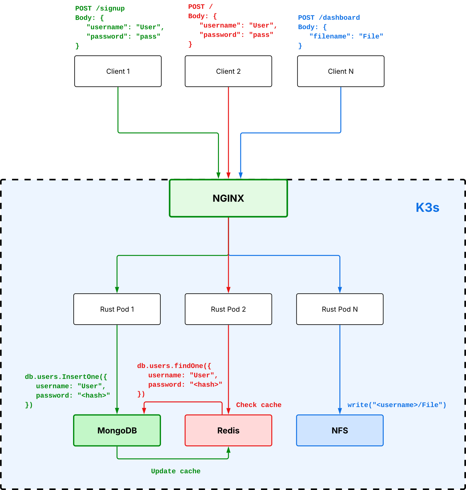
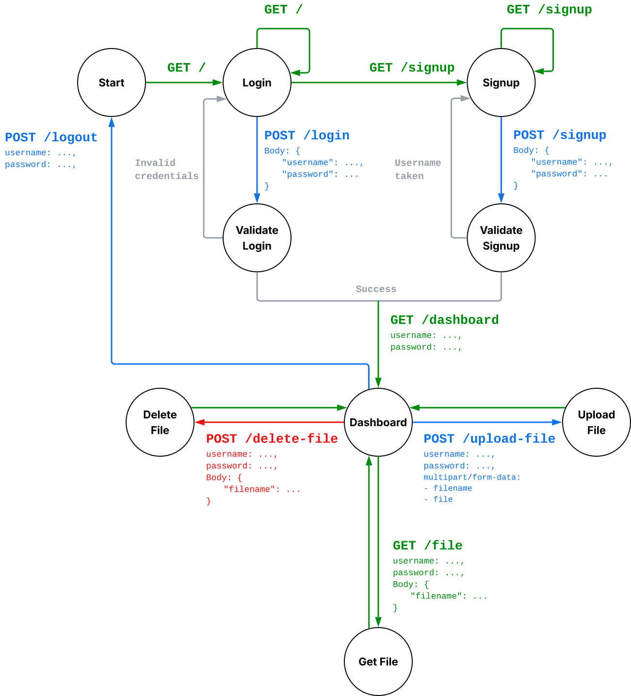

## I. Goal / Tasks of the Project

### Project Goal

The goal of the project is to develop and deploy a lightweight distributed file storage platform with secure file management, scalable infrastructure, monitoring, and automated deployment.

The project focuses on:

* simple user authentication and file management
* horizontal scalability using Kubernetes
* centralized persistent file storage
* infrastructure observability and metrics collection
* automated testing and deployment pipeline

### Team Responsibilities

* **Semen Nadutkin** — RustyCloud backend application, Docker containerization, server configuration
* **Magomedgadzhi Ibragimov** — MongoDB, Redis, Prometheus configuration and Kubernetes manifests
* **Stefan Farafonov** — project infrastructure design and documentation
* **Damir Bayazitov** — local GitHub runner deployment, CI/CD pipeline

## II. Execution Plan / Methodology

### Solution Plan

The project implementation was divided into several stages:

1. Develop the RustyCloud backend application in Rust
2. Containerize the application using Docker
3. Deploy the infrastructure using Kubernetes (`k3s`)
4. Configure distributed services and persistent storage
5. Configure monitoring and metrics collection
6. Implement automated testing and deployment pipeline

### Infrastructure Overview

#### Core Technologies

* **Backend:** Rust (`axum`)
* **Containerization:** Docker
* **Orchestration:** Kubernetes (`k3s`)
* **Ingress Controller:** NGINX
* **Database:** MongoDB
* **Caching:** Redis
* **Monitoring:** Prometheus, Grafana
* **Persistent File Storage:** NFS
* **Deployment Management:** Kustomize
* **СI/CD:** GitHub Actions, Self-hosted Runner
* **Testing:** Pytest

### Infrastructure Design

The infrastructure consists of several interconnected Kubernetes components:

* `NGINX` ingress controller accepts external HTTP/HTTPS requests
* RustyCloud application pods process client requests
* MongoDB stores persistent user credentials and file metadata
* Redis provides in-memory caching for fast data access
* NFS provides centralized shared file storage for all application replicas
* Prometheus collects infrastructure and application metrics
* Grafana visualizes monitoring and performance data

Internal communication between services is implemented using Kubernetes DNS and `ClusterIP` services.

Persistent components use `PersistentVolume` and `PersistentVolumeClaim` resources for durable storage.

### Request Flow

1. Web clients send requests to the RustyCloud domain.
2. NGINX ingress accepts HTTPS traffic and distributes requests between RustyCloud instances.
3. RustyCloud instances authenticate users and process file operations.
4. Metadata is stored in MongoDB and Redis.
5. Uploaded files are stored on the centralized NFS volume.

See **Figure 1: Project architecture diagram** for details.

**Figure 1: Project architecture diagram**

## III. Development of Solution / Tests as the PoC

### RustyCloud Application

#### Application Functionality

The RustyCloud backend application was implemented in Rust using the `axum` framework.

The application provides:

* user authentication and registration
* file upload and download
* file deletion
* session handling using cookies
* HTML template rendering

### HTTP Endpoints

#### Authentication

* `GET /` — login page
* `GET /signup` — signup page
* `POST /login` — user authentication
* `POST /signup` — user registration

#### User Dashboard

* `GET /dashboard` — user dashboard with uploaded files

#### File Operations

* `GET /file` — download a file
* `POST /upload-file` — upload a file
* `POST /delete-file` — delete a file

Authentication is validated using cookies containing user credentials.

See **Figure 2: Web client FSM** for details.

**Figure 2: Web client FSM**

### CI/CD Pipeline 

A fully automated CI/CD pipeline was implemented using GitHub Actions and a self-hosted runner.

#### Self-hosted Runner Setup:

* A local Fedora machine was configured as a GitHub Actions runner.
* The runner was registered with the repository and configured to execute pipeline jobs.
* Necessary dependencies (Docker, Python, pytest) were pre-installed on the runner machine.

#### CI/CD Pipeline Stages:

1. Build — Docker image of the RustyCloud application is built and pushed to Docker Hub.
2. Test — The container is started in a test environment with MongoDB and Redis dependencies. Functional tests written in pytest are executed against the running application.
3. Deploy — Upon successful tests, the application is automatically deployed to the production server via SSH using the `deploy.sh` script.

#### Deployment Automation:

* The `deploy.sh` script pulls the latest Docker image, applies a new configuration to all Kubernetes pods, performs rolling update for the application by using the new Dockerfile
* The pipeline uses GitHub Secrets to securely store sensitive information (Docker Hub credentials, server IP, database credentials).

### Containerization and NGINX Ingress

#### Docker Optimizations:

* A multi-stage Dockerfile was implemented to minimize the final image size.
* The build stage compiles the Rust application, while the runtime stage only includes the compiled binary and necessary dependencies.
* Debian:13-slim Linux was used as the base image to reduce attack surface and improve performance.

#### Kubernetes Manifests:
* Kubernetes `Deployment` and `Service` resources were created to manage the RustyCloud application pods.
* `PersistentVolume` and `PersistentVolumeClaim` were configured for NFS-backed shared storage.
* Kubernetes `Secrets` were used to inject environment variables (database credentials, NFS server address) securely.

#### NGINX Ingress Configuration:

* NGINX Ingress Controller was deployed to handle external HTTP/HTTPS traffic, replaced default k3s ingress (Traefik)
* Ingress rules were defined to route requests from rustycloud.ru to the RustyCloud service.
* SSL/TLS certificates were obtained and automatically renewed using certbot to enable HTTPS encryption.

### Kubernetes Infrastructure

The infrastructure was deployed on `k3s` using declarative Kubernetes manifests and Kustomize.

#### RustyCloud Deployment

The RustyCloud application is deployed using Kubernetes `Deployment`, `Service`, `Ingress`, `PersistentVolume`, `PersistentVolumeClaim`, and `Secret` resources.

Implemented configuration includes:

* application deployment using Docker Hub container image
* internal `ClusterIP` service for pod communication
* `NGINX` ingress routing for external access
* NFS-backed shared persistent storage with `ReadWriteMany`
* environment variable injection using Kubernetes Secrets
* shared volume mounting into application containers

This configuration allows application replicas to share centralized file storage and communicate through Kubernetes networking primitives.

#### MongoDB

Implemented using StatefulSet with persistent storage.

* PVC-backed storage
* Kubernetes Secrets for credentials
* automatic initialization scripts via ConfigMap
* internal DNS resolution using headless service

**Limitations:** single replica deployment, no replication or automatic backups

#### Redis

Implemented as an internal caching service.

* ClusterIP service
* lightweight in-memory cache

**Limitations:** no persistence, single replica, no replication or failover

#### Prometheus

Used for metrics collection and monitoring.

* StatefulSet deployment
* persistent storage
* RBAC configuration
* static scrape configuration

**Limitations:** no dynamic service discovery, no Alertmanager integration, single replica deployment

#### Grafana

Used for metrics visualization.

* persistent dashboard storage
* automatic datasource provisioning
* predefined dashboards loaded via ConfigMap

**Limitations:** no external authentication, single instance deployment

### Containerization and Deployment

The RustyCloud application was containerized using Docker multi-stage builds.

Deployment configuration includes:

* Kubernetes Deployments and StatefulSets
* ConfigMaps and Secrets
* PersistentVolumeClaims
* NGINX ingress configuration
* SSL termination using `certbot`

### Testing and Proof of Concept

The project includes automated backend tests and deployment automation.

Implemented testing areas:

* HTTP endpoint testing
* authentication flow validation
* file upload and retrieval testing
* CI/CD pipeline integration

#### Functional Testing:

* A comprehensive test suite was written using Python's pytest and requests libraries.
* The tests verify all critical HTTP endpoints including:
    * User registration (`/signup`) and login (`/login`)
    * Dashboard access (`/dashboard`)
    * File upload (`/upload-file`), download (`/file`), and deletion (`/delete-file`)
    * Authentication and session handling
    * Logout functionality
* Each test validates HTTP status codes, redirect behavior, and response content.

Deployment automation includes:

* local GitHub runner
* automated build and deployment scripts
* Kubernetes rollout deployment process

The infrastructure and application were successfully deployed and tested in a working `k3s` environment.

## IV. Difficulties Faced and New Skills Acquired

### Difficulties

During the project development several technical challenges were encountered:

* configuring communication between Kubernetes services
* debugging DNS resolution in `k3s`
* managing persistent storage for StatefulSets
* integrating NFS with multiple application replicas
* configuring Kubernetes Secrets and ConfigMaps
* debugging container networking and ingress configuration
* integrating monitoring services with Kubernetes workloads

### Skills Acquired

The project provided practical experience with:

* Rust backend development using `axum`
* Docker containerization and multi-stage builds
* Kubernetes resource management
* StatefulSet and Deployment configuration
* Kubernetes networking and DNS
* Kustomize deployment structure
* monitoring stack deployment using Prometheus and Grafana
* CI/CD pipeline integration
* infrastructure debugging and observability

## V. Conclusion

The project demonstrates a functional distributed file storage platform deployed on Kubernetes infrastructure.

The implemented system successfully provides:

* scalable backend deployment
* centralized persistent file storage
* Kubernetes-based orchestration
* automated deployment pipeline
* infrastructure monitoring and visualization
* persistent storage for stateful services
* automated testing with CI/CD integration using GitHub Actions and self-hosted runner
* secure HTTPS traffic handling with NGINX Ingress and SSL termination
* functional test suite covering authentication and file operations

The current implementation also has several limitations:

* limited monitoring automation
* violation of RESTful API
* lack of automated backup mechanisms
* too small server for replicas
* CI/CD pipeline relies on Fedora and RHEL runners without high availability

Despite these limitations, the project successfully demonstrates the practical implementation of a cloud-native distributed application using modern infrastructure technologies.

## Links

* Repository: [RustyCloud](https://github.com/SNA-S26/RustyCloud)
* Deployed application: [rustycloud.ru](https://rustycloud.ru)
* Kubernetes manifests: [infrastructure](https://github.com/SNA-S26/RustyCloud/tree/main/infra)
